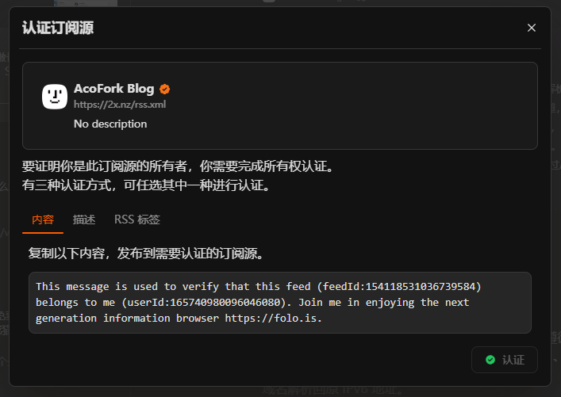

# 这是啥？

这是一篇Folo认证文章，用于认证本RSS归属于我

Zola：

This message is used to verify that this feed (feedId:154118531036739584) belongs to me (userId:165740980096046080). Join me in enjoying the next generation information browser https://folo.is.

Fuwari：

This message is used to verify that this feed (feedId:180993728847509504) belongs to me (userId:165740980096046080). Join me in enjoying the next generation information browser https://folo.is.

# 我要怎么认证？

首先 你得有一个博客，或者说一个有RSS的网站

比如 2x.nz/rss.xml

接下来在Folo处点击认证 https://folo.is

会弹出一个内容，要求让你放置到RSS

最简单的方法就是像我这样新建一篇文章，然后原封不动粘贴这段话，然后认证即可

