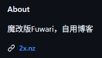
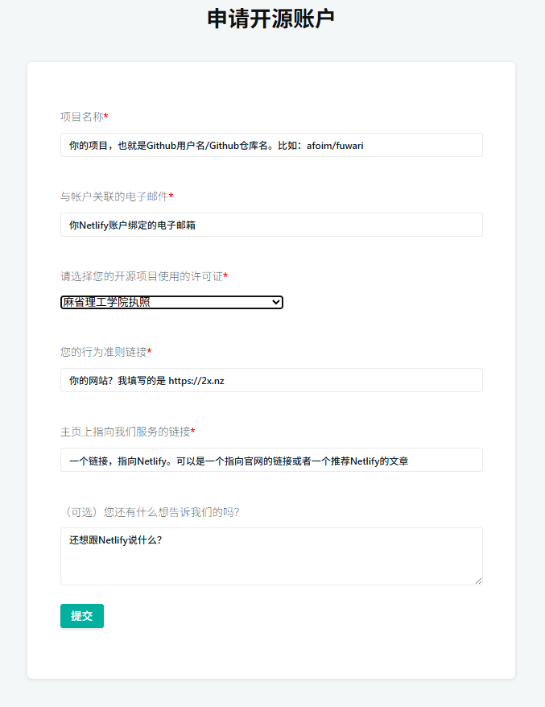
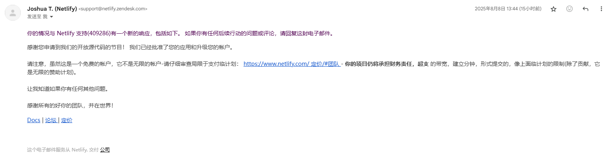
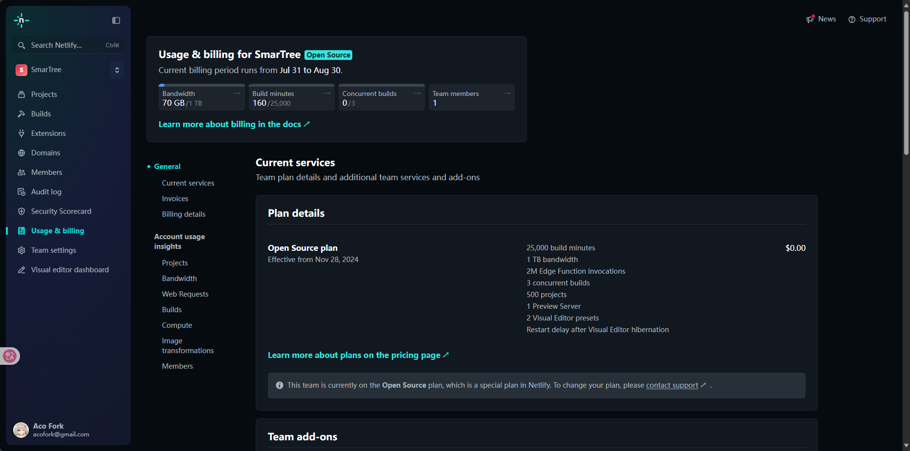

# 正式开始

> [! WARNING]
> 
> Netlify OSS计划不受理个人博客

确保你有一个开源项目，并且已经托管在了Netlify，Github的也有你网站的链接


前往 https://opensource-form.netlify.com/

填写相关信息，提交。

我是这样写的

```textile
Open Source Team Application
Applicant Name: no name provided
Applicant Email: acofork@gmail.com
Project Name: afoim/fuwari
Proof of Contributors:
Code of Conduct URL: https://2x.nz
Project License URL: MIT license
Netlify Site URL: https://2x.nz/posts/static-web/#netlify
Notes:
```



一天后收到已开通 `Open Source` 计划的邮件。如果没有通过也没关系，你可以直接回复这封邮件，带上你的疑问，注意使用英文



账户也自动从 `Starter` 升级到了 `Open Source` 计划


