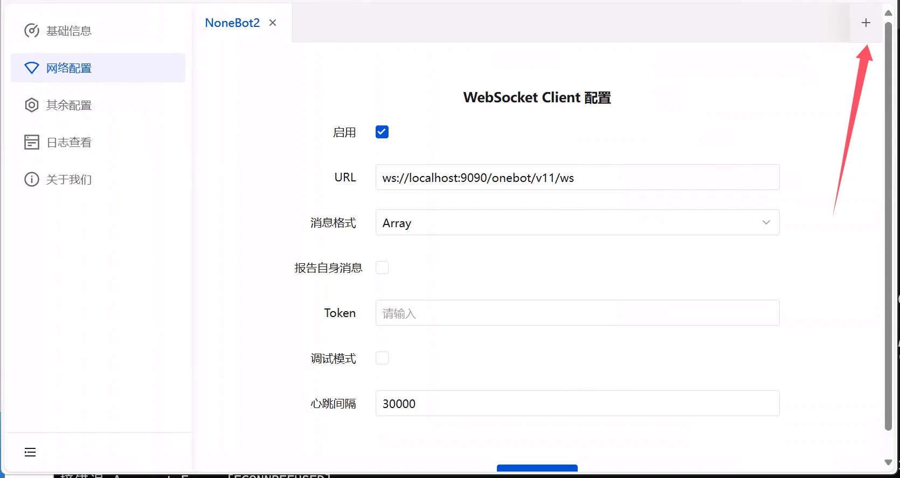

# 安装 NapCat(Win)

> 用于登录 QQ 实现收发消息

1. 进入[Release NapCat V4.1.12 · NapNeko/NapCatQQ · GitHub](https://github.com/NapNeko/NapCatQQ/releases/latest)，下载`NapCat.Shell.zip`

2. 将其解压到一个单独的文件夹，然后打开命令行，运行`launcher.bat <BOT QQ号>`

3. 运行后通过手机扫码登录

4. 它会打印本地控制台的地址信息，如：`[NapCat] [WebUi] WebUi Local Panel Url: http://127.0.0.1:6099/webui?token=4xldg5fqb1`

5. 直接进入，如图配置即可（端口号可以自己修改，但是要和下部分NoneBot2监听的端口一致。这里是9090）

# 安装 NoneBot2

用于实现逻辑，控制 NapCat 收发消息

1. 首先，你得装[Python](https://www.python.org/downloads/)。Windows可以使用 https://scoop.sh/

2. pypi 清华源：`pip config set global.index-url https://pypi.tuna.tsinghua.edu.cn/simple`

3. 装 pipx：`pip install pipx`。你也可以使用`scoop install pipx`

4. 设置 pipx 全局变量：`pipx ensurepath`

5. 装 nb-cli：`pipx install nb-cli`

6. **如果找不到 nb 命令：** 对于 root 用户，你可以编辑 `/root/.bashrc` 或 `/root/.profile`（如果你使用的是 Bash）： `nano /root/.bashrc` 添加以下行： `export PATH="$HOME/.local/bin:$PATH"` 保存并重新加载配置： `source /root/.bashrc`

7. 装 nb bootstrap：`nb self install nb-cli-plugin-bootstrap`

8. 新建项目，选一个你喜欢的文件夹，然后：`nb bs` （看不懂的就一路回车）

示例：

```
C:\afbot>nb bs
加载适配器列表中……
请输入项目名称
[?] 请输入 > onanibot
[?] 请选择你想要使用的适配器 OneBot V11 (OneBot V11 协议)
请输入 Bot 超级用户，超级用户拥有对 Bot 的最高权限（如对接 QQ 填 QQ 号即可）（留空回车结束输入）
[?] 第 1 项 >
请输入 Bot 昵称，消息以 Bot 昵称开头可以代替艾特（留空回车结束输入）
[?] 第 1 项 >
请输入 Bot 命令起始字符，消息以起始符开头将被识别为命令，
如果有一个指令为 查询，当该配置项中有 "/" 时使用 "/查询" 才能够触发，
留空将使用默认值 ['', '/', '#']（留空回车结束输入）
[?] 第 1 项 >
请输入 Bot 命令分隔符，一般用于二级指令，
留空将使用默认值 ['.', ' ']（留空回车结束输入）
[?] 第 1 项 >
请输入 NoneBot2 监听地址，如果要对公网开放，改为 0.0.0.0 即可
[?] 请输入 > 127.0.0.1
请输入 NoneBot2 监听端口，范围 1 ~ 65535，请保证该端口号与连接端配置相同，或与端口映射配置相关
[?] 请输入 > 8080
[?] 是否在项目目录中释出快捷启动脚本？ Yes
[?] 是否将 localstore 插件的存储路径重定向到项目路径下以便于后续迁移 Bot？ Yes
[?] 是否使用超级用户 Ping 指令回复插件？ Yes
[?] 是否安装 logpile 插件提供日志记录到文件功能？ Yes
[?] 是否在启动脚本中使用 webui 插件启动项目以使用网页管理 NoneBot？（该插件仍在开发中，不推荐用于生产环境） No
成功新建项目 onanibot
[?] 是否新建虚拟环境？ Yes
正在 C:\afbot\onanibot\.venv 中创建虚拟环境
创建虚拟环境成功
[?] 是否需要修改或清除 pip 的 PyPI 镜像源配置？ No
[?] 是否立即安装项目依赖？ Yes
正在安装项目依赖
依赖安装成功
[?] 请选择需要启用的内置插件
项目配置完毕，开始使用吧！
```

9. 项目创建完毕后启动：`nb run`

10. 出现：`[INFO] nonebot | OneBot V11 | Bot XXXXXXXXXX connected` 你就成功连接上 Lagrange 了

11. 测试，发个`/ping`，看是否出现Pong~

12. 如果你要调试 NoneBot2，请先使用`nb` 进入虚拟环境。然后使用`pip install <包名>`
