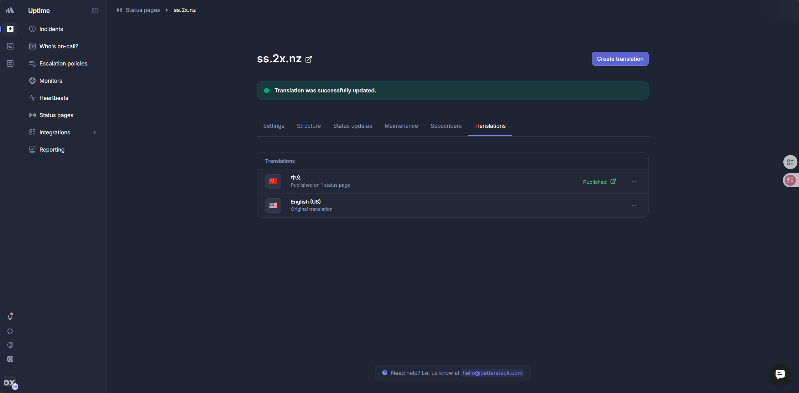
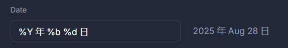
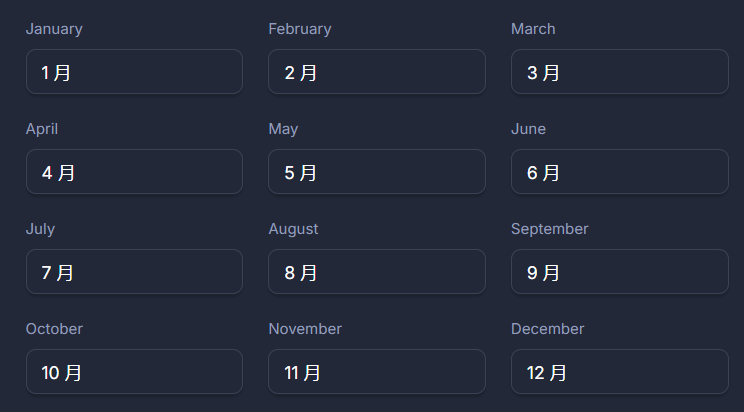
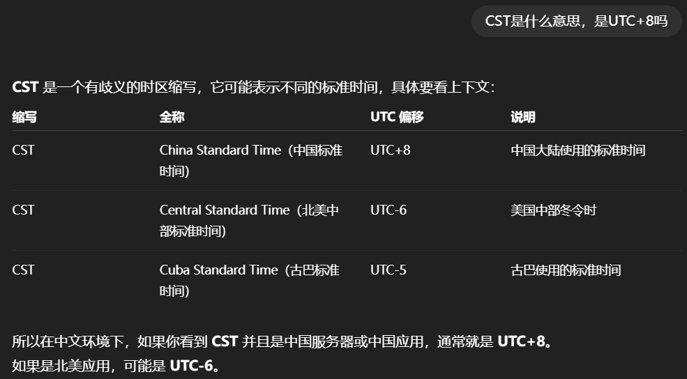
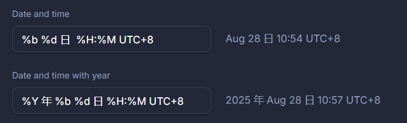

# 速览

现在点击 [这里](https://ss.2x.nz) 或者顶部导航栏的 `状态` 即可查看中文的BetterStack的状态面板

# 汉化过程

在 [BetterStack](https://uptime.betterstack.com/) 左侧导航条的 `Status pages` 进入你的状态面板域名，然后进入 `Translations` 即可开始汉化

# 一些小插曲

因为BetterStack完全没有顾及中国用户，所以对于 `日` 和 `年` 的翻译没有后缀，不过我们可以硬编码一下

而对于 `月` 直接这样写

BetterStack对于 `UTC+8` 会自作聪明使用 `CST` 。这是一个有歧义的时区缩写，我们同样可以使用硬编码来解决

